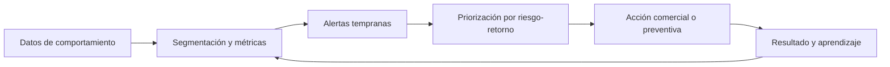

# Radar Persona 360

**Cockpit ejecutivo de monitoreo de riesgo crediticio minorista**

Proyecto de portafolio diseñado para demostrar cómo transformar señales de
comportamiento, exposición, pérdida esperada y rentabilidad en decisiones
accionables para una cartera de clientes personas.

[**Abrir demo ejecutiva**](https://hquezadah.github.io/radar-persona-360/) ·
[Brief ejecutivo](docs/EXECUTIVE_BRIEF.md) ·
[Guion para la VP](docs/INTERVIEW_DEMO.md)

> Caso demostrativo. Todos los datos, clientes, reglas, coeficientes e impactos
> son sintéticos. El proyecto no contiene información confidencial ni representa
> la metodología de una entidad financiera.


## Qué resuelve

Una VP de Riesgo no necesita otro tablero que describa el pasado. Necesita una
vista que permita responder:

- dónde se está formando el próximo deterioro;
- cuánto riesgo y rentabilidad están comprometidos;
- qué acción focalizada debe ejecutarse;
- quién es responsable y cómo se medirá el resultado.

Radar Persona 360 conecta esas preguntas en un ciclo de gestión:



## Capacidades demostradas

- **Monitoreo ejecutivo:** exposición, mora 30+, pérdida esperada, RAROC y
  salud del portafolio.
- **Segmentación:** lectura diferenciada de crecimiento, estabilidad y
  vigilancia.
- **Alertas explicables:** condición, exposición, acción sugerida, dueño y
  regla.
- **Estrés interactivo:** sensibilidad a desempleo, tasa activa e inflación.
- **Gestión de ciclo de vida:** acciones para nómina joven, revolventes,
  refinanciados y perfiles prime.
- **Rentabilidad ajustada por riesgo:** priorización sin restricción
  generalizada.
- **Gobierno:** trazabilidad, champion/challenger, validación y límites de uso.
- **MIS exportable:** descarga en CSV desde el dashboard.

## Demo local

Requiere Node.js 20 o superior. No instala paquetes ni usa servicios externos.

```bash
npm run dev
```

Abre [http://localhost:4173](http://localhost:4173).

Para ejecutar todas las validaciones:

```bash
npm run check
```

Para consultar el motor analítico:

```bash
python3 analytics/risk_engine.py --scenario base
python3 analytics/risk_engine.py --scenario moderate
python3 analytics/risk_engine.py --scenario severe
```

## Arquitectura

```text
.
├── index.html                    # Cockpit ejecutivo
├── styles.css                    # Sistema visual responsive
├── app.js                        # Interacciones, escenarios y MIS
├── analytics/
│   └── risk_engine.py            # EL, RAROC, estrés y alertas
├── sql/
│   └── portfolio_monitoring.sql  # Mart, KPIs y reglas de monitoreo
├── tests/                        # Pruebas Node y Python
├── docs/
│   ├── EXECUTIVE_BRIEF.md        # Caso de negocio y piloto de 90 días
│   ├── MODEL_GOVERNANCE.md       # Gobierno y validación
│   └── INTERVIEW_DEMO.md         # Guion de presentación para la VP
└── .github/workflows/pages.yml   # Validación y despliegue en GitHub Pages
```

## Métricas

La demo distingue cuatro familias:

| Familia | Ejemplos | Decisión |
| --- | --- | --- |
| Calidad | mora, roll rate, cosechas, curas | intervenir u observar |
| Pérdida | PD, LGD, EAD, EL | cobertura y apetito |
| Rentabilidad | margen, costo de riesgo, RAROC | crecer, repricing o contener |
| Concentración | producto, empleador, segmento | límites y diversificación |

El motor Python implementa cálculos trazables:

```text
EL 12M = EAD × PD × LGD
RAROC simplificado = (margen neto - EL 12M) / capital económico
```

Los coeficientes de estrés son deliberadamente transparentes para que puedan
ser sustituidos por elasticidades calibradas y validadas.

## Propuesta de piloto

1. **Días 1-30:** reconciliar fuentes, definir métricas, parametrizar apetito y
   ejecutar backtesting.
2. **Días 31-60:** desplegar dos casos de uso con champion/challenger.
3. **Días 61-90:** medir pérdida evitada, rentabilidad, cura y experiencia del
   cliente; decidir escalamiento.

La historia completa está en el
[brief ejecutivo](docs/EXECUTIVE_BRIEF.md) y el
[guion de demostración](docs/INTERVIEW_DEMO.md).

## Diseño responsable

- Sin datos personales ni información real.
- Separación explícita entre dato observado, estimación y escenario.
- Alertas explicables y versionables.
- Ninguna acción adversa automática propuesta.
- Validación independiente antes de cualquier uso productivo.

Consulta [gobierno analítico](docs/MODEL_GOVERNANCE.md) para el marco completo.

## Autor

**Hector Quezada**  
Proyecto de candidatura · Gerencia de Monitoreo de Riesgos Persona · 2026
