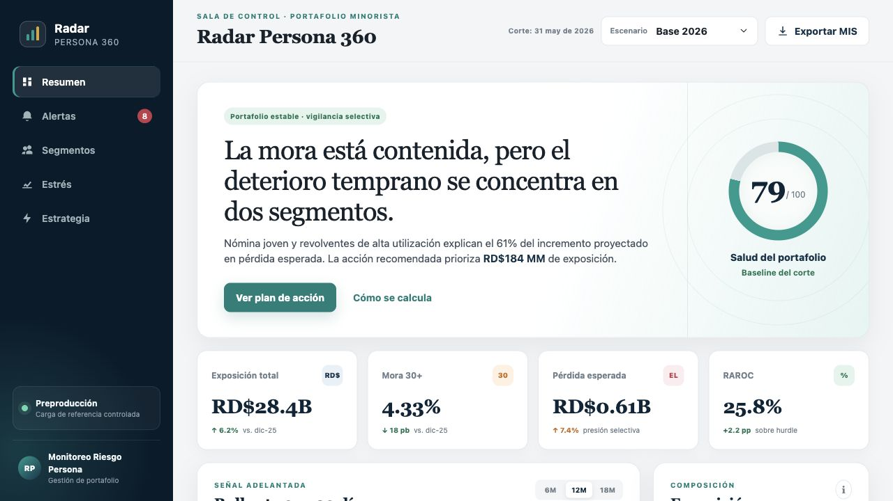
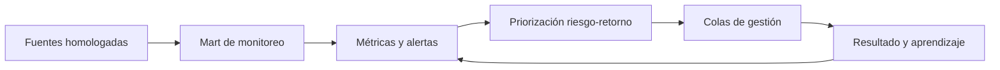

# Radar Persona 360

**Plataforma de monitoreo y decisión para riesgo crediticio de personas**

Radar Persona 360 integra calidad de cartera, señales tempranas, exposición,
pérdida esperada y rentabilidad ajustada por riesgo en un ciclo operativo:
detectar, priorizar, asignar, ejecutar y medir.

[**Abrir sala de control**](https://hquezadah.github.io/radar-persona-360/) ·
[Mandato ejecutivo](docs/EXECUTIVE_BRIEF.md) ·
[Arquitectura objetivo](docs/TARGET_ARCHITECTURE.md) ·
[Plan de implementación](docs/DELIVERY_PLAN.md)

> La instancia pública opera en preproducción con una carga de referencia
> controlada. No contiene datos personales, información institucional,
> credenciales ni parámetros confidenciales. La operación interna se habilita
> conectando las vistas homologadas y completando los controles de salida
> descritos en este repositorio.



## Objetivo operativo

La plataforma responde diariamente cinco preguntas:

1. ¿Dónde se está formando el próximo deterioro?
2. ¿Qué exposición y rentabilidad están comprometidas?
3. ¿Qué acción corresponde según el perfil y el apetito?
4. ¿Quién debe ejecutarla y dentro de qué SLA?
5. ¿Qué resultado produjo la decisión a 30, 60 y 90 días?



## Alcance funcional

- **Monitoreo ejecutivo:** exposición, mora, roll rates, cosechas, pérdida
  esperada, concentración y RAROC.
- **Segmentación:** perfiles de crecimiento, estabilidad, vigilancia y
  contención.
- **Alertas tempranas:** razón, severidad, exposición, acción, responsable,
  versión y SLA.
- **Estrés:** sensibilidad por escenario macroeconómico y consumo de apetito.
- **Ciclo de vida:** originación, mantenimiento de límites, cross-sell,
  refinanciamiento y cobranza temprana.
- **Gestión de estrategia:** champion/challenger, grupo de control y medición de
  pérdida evitada.
- **MIS:** salida reproducible para comités, Finanzas, Riesgo y Negocio.

## Estado de implementación

| Componente | Estado | Condición de salida |
| --- | --- | --- |
| Sala de control web | Construido | UAT con usuarios de Riesgo |
| Motor de EL, RAROC y estrés | Construido | Calibración institucional |
| Reglas de alerta | Parametrizables | Backtesting y aprobación |
| Consulta de mart | Definida | Mapeo a vistas homologadas |
| Contrato de datos | Definido | Aprobación de Data Owner |
| Gobierno y bitácora | Definido | Integración con flujo operativo |
| Despliegue interno | Pendiente | Infraestructura y seguridad |

## Ejecución local

Requiere Node.js 20 o superior y Python 3.11 o superior. No instala paquetes ni
utiliza servicios externos.

```bash
npm run dev
```

Abre [http://localhost:4173](http://localhost:4173).

Validación completa:

```bash
npm run check
```

Motor analítico por escenario:

```bash
python3 analytics/risk_engine.py --scenario base
python3 analytics/risk_engine.py --scenario moderate
python3 analytics/risk_engine.py --scenario severe
```

Construcción de un snapshot desde un extracto segmentado:

```bash
python3 -m pipeline.build_snapshot \
  --input data/reference/segment_snapshot.csv \
  --output data/monitoring_snapshot.json \
  --as-of 2026-05-31
```

## Arquitectura del repositorio

```text
.
├── index.html                     # Sala de control
├── styles.css                     # Sistema visual responsive
├── app.js                         # Escenarios, alertas, filtros y MIS
├── analytics/
│   └── risk_engine.py             # EL, RAROC, estrés y reglas
├── pipeline/
│   └── build_snapshot.py          # Validación y publicación del corte
├── data/reference/
│   └── segment_snapshot.csv       # Fixture controlado para CI
├── schemas/
│   └── monitoring_snapshot.schema.json
├── sql/
│   └── portfolio_monitoring.sql   # Mart y agregaciones
├── config/
│   └── alert_rules.json           # Umbrales versionados
├── docs/                          # Arquitectura, gobierno y operación
└── .github/workflows/pages.yml    # Validación de la instancia pública
```

## Controles de producción

- reconciliación contra saldos contables y MIS oficial;
- pruebas de completitud, unicidad, vigencia y estabilidad;
- segregación entre desarrollo, validación y aprobación;
- trazabilidad de regla, decisión, excepción y resultado;
- cifrado, mínimo privilegio y ausencia de PII en logs;
- rollback de parámetros y despliegues;
- monitoreo de falsos positivos, cura, RAROC y experiencia del cliente.

Los criterios completos están en
[Gobierno analítico](docs/MODEL_GOVERNANCE.md) y
[Contrato de datos](docs/DATA_CONTRACT.md).

## Métricas

```text
EL 12M = EAD × PD × LGD
RAROC = (margen neto - pérdida esperada - costos atribuibles) / capital económico
```

Las fórmulas finales deben usar definiciones institucionales homologadas. Los
umbrales se administran fuera del código, con versionado, vigencia, aprobador y
evidencia de validación.

## Despliegue

La instancia pública valida experiencia de usuario y automatización. El destino
operativo recomendado es una red privada con autenticación corporativa, API de
solo lectura sobre el mart y bitácora de decisiones en una base transaccional.

Consulta [Arquitectura objetivo](docs/TARGET_ARCHITECTURE.md) y
[Plan de implementación](docs/DELIVERY_PLAN.md).

## Propiedad

**Unidad responsable:** Monitoreo de Riesgo Persona

**Interesados:** Riesgo, Negocio, Cobranzas, Finanzas, Modelos, Datos y Tecnología
