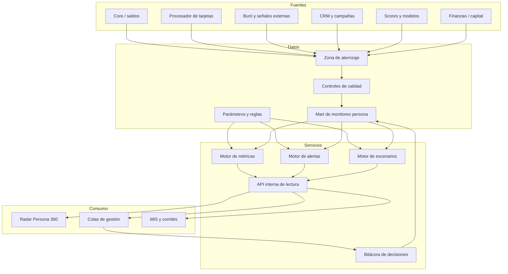

# Arquitectura objetivo

## Principios

- una definición por métrica;
- fuentes homologadas y linaje visible;
- reglas fuera del código y versionadas;
- API de solo lectura para indicadores;
- separación entre cálculo, decisión y ejecución;
- mínima exposición de datos personales;
- trazabilidad de extremo a extremo.

## Componentes

### Mart de monitoreo

Grano mínimo: cuenta por fecha de corte. Debe permitir agregación por cliente,
producto, segmento, empleador, zona, cosecha y estrategia.

### Motor de métricas

Calcula indicadores reproducibles con fecha de proceso, versión de definición y
control de reconciliación.

### Motor de alertas

Evalúa reglas parametrizadas, evita duplicados, asigna severidad y registra
reason codes.

### Bitácora

Registra asignación, decisión, excepción, contacto y resultado. No debe
sobrescribir historia.

### Sala de control

Consume agregados y poblaciones autorizadas. La vista ejecutiva no necesita PII.
El detalle de cuenta requiere rol y propósito válido.

## Seguridad

- SSO y grupos corporativos;
- cifrado en tránsito y reposo;
- secretos en gestor institucional;
- tokenización de identificadores;
- logs sin PII;
- segregación DEV/UAT/PROD;
- escaneo de dependencias y revisión de acceso trimestral.

## Disponibilidad

| Componente | Objetivo inicial |
| --- | --- |
| Actualización de datos | diaria antes de la jornada |
| Disponibilidad | 99.5% en horario operativo |
| RPO | 24 horas |
| RTO | 4 horas |
| Retención de bitácora | según política institucional |
